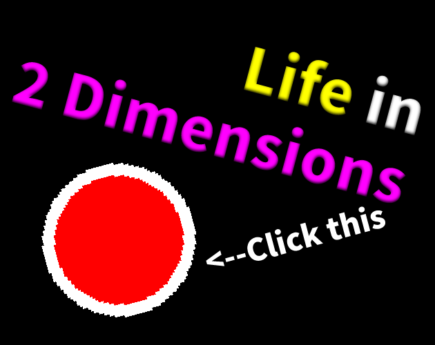

# Life in 2 Dimensions

A clicker game about a person's life in 2 dimensions.

## Gameplay

You live in 2 dimensions. In dimension 1, you are immortal. In dimension 2, you die very soon. Your job is to press a big red button. Every time you reach the goal, dimension 2's health will increase. Yeah, this gameplay sucks because I am dumb.

## Fun Fact

This game originally was made with Bevy Engine. However, I was too lazy so I switched to Godot. Also, the original gameplay was a person switching between 2D and 3D. The idea was scrapped because it is too hard to implement with my knowledge.

Jim. (My name isn't Jim.)
